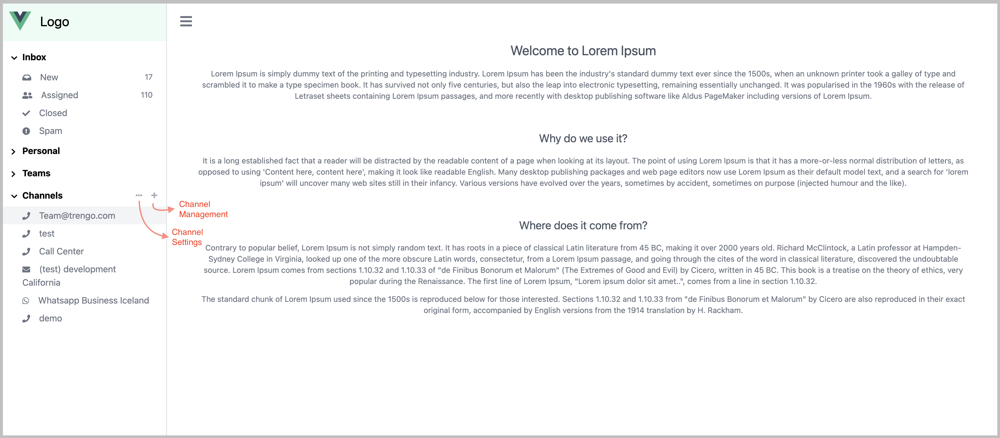
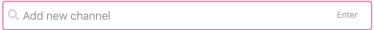

# Vue Channel Settings and Management

## Description

This is a channel settings and management on communication platform.



#### Project specification

> Framework : Vue 2.6.11
> 
> End to end test : Cypress 7.2.0
>
> Icons : Font Awesome 5.15.3
>
> CSS : Tailwind 2.1.0
>
> State management : Vuex 3.6.2
>
> Library : Vue-smooth-dnd 0.8.1


## Features

### Features in Channel Management (+)

<sup>Notes : All changes for the channel data will be save after clicking on the `Apply` button.</sup>

#### Drag and drop

This feature can be used by clicking and drag this  icon.

#### Search and Add new channel

This feature can be used for searching the channel  and create the channel by hitting the `Enter` button on your keyboard. 

#### Remove channel

This feature can be used for removing the channel

### Features in Channel Settings (‧‧‧)

#### Search channel

This feature can be used for search the existing channel.

#### Toggle notification

This feature can be used for enable/disable the notification.

#### Toggle active channel

This feature can be used for activate/deactivate the channel.

This feature will show/hide the channel on Sidebar.

### Responsive

This application has been support the responsive web design.

It means it can be run on multiple screen size.


## Project commands

#### Project setup
```
npm install
```

#### Compiles and hot-reloads for development
```
npm run serve
```

#### Compiles and minifies for production
```
npm run build
```

#### Lints and fixes files
```
npm run lint
```

#### Customize configuration
See [Configuration Reference](https://cli.vuejs.org/config/).
